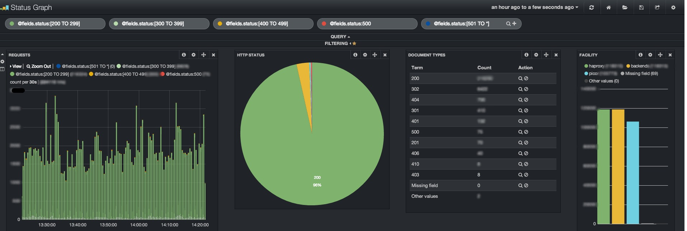

Why o why ?
==

At fotopedia, we use only EC2 virtual servers. This has several advantages, such as the fact that we never have to handle large metal boxes in large white cold rooms. One of the main disadvantages, however, is that this is running on "cheap" hardware and the CPU available is sometimes quite virtual.

We use almost only m1.xlarge instances which have 4 cores and 15G of memory and, in order to make the bill thinner, we pack as much services in our administration instances as possible. As they never face the public, we can handle a higher than average load without being too mad about it.

Recently, we decided to switch from MongoDB to ElasticSearch for our primary log storage database, for several reasons (yes we can probably talk about that somewhere, but this is not yet Friday), but the most important one is **KIBANA**.



Kibana is a very nice frontend for ElasticSearch, developped with [Logstash](http://logstash.net/docs/1.2.2/) data in mind. Basically, you generate logs with your applications (via syslog, log files, whatever) and Logstash will read all these sources and pipe them into ElasticSearch. Please go and read [Logstash](http://logstash.net/docs/1.2.2/) documentation if you want to know more about that. This is an impressive piece of software.

[Kibana](http://www.elasticsearch.org/overview/kibana/) has the same awesomeness inside. It plugs on any ElasticSearch server, can dig its indices almost automatically and is very fun to use. Also, it doesn't need an application server to run and does all the magic inside your browser!

We installed the usual setup on one of our admin servers (load average: 8.0 !), a Logstash with a simple configuration, a dedicated elasticsearch, and rolled on. We quickly patched our main Rails application to be able to send its events in Logstash and soon, we were seeing traffic flooding in the ElasticSearch!

Then we patched another logger in our infrastructure, the one responsible for sending all the HAProxy logs to our analysis infrastructure. But then something wrong happened: all the logs were flooding in normally, then, suddenly, no more logs from the HAProxy for a while, then it started again, then it broke again...

Turns out the Logstash instance was not fast enough to process all the data coming in from the internet and was taking too much time to answer its requests from the log producer. The log producer then decided to stop feeding the logstash for a while and resumed again moments later, with the same scenario.

On the CPU side, the logstash was using more than 100% of CPU, but still delivered some data to the ES.

As suggested in the doc, I decided to add a Redis instance between the app servers and the ElasticSearch to buffer the requests and hopefully provide a better scalability. While I was there, I rewrote the Rails and Haproxy logger to write directly the data in Redis so that I could keep a single Logstash instance on my administration server. My logstash would then only play the role of an electronic pipe applying a very simple processing to the incoming stream.

To be "conservative", the Rails application would trim the Redis list to 10k elements and no more. Nobody wanted the redis to run out of memory and 10k seemed a fair choice of queue length.

The following configuration was then setup for logstash:


```
input {
    redis {
      data_type => "list"
      key => "prod"
      type => "prod"
      threads => 4
    }

  }
  filter {
    date {
      match => [ "date", "UNIX_MS" ]
    }
    mutate {
      rename => [ "instance", "host" ]
    }
  }
  output {
    elasticsearch {
      host => "localhost"
      port => 9100
      index => "logstash-%{+YYYY.MM.dd.HH}"
    }
  }
```

And off, we started everything. Soon, the Redis queue started growing. And growing. And topped 10,000 elements. Logstash started reading the data in Redis.

But the queue remained full.

And still logstash was reading in it, but not fast enough.

We tweaked the logstash instance in everyway possible:
- added `-w` more workers
- added more `threads` to the Redis reader
- `workers` in the elasticsearch output
- switched to the `elasticsearch_http` output

But no visible result.

My wonderful colleague, kali, even ran YourKit on Logstash to see if something was going wrong, without any obvious result (between the JRuby internals and the number of ElasticSearch threads, it is quite difficult to see what is happening inside the animal).

Finally, we setup a **dedicated** new box, with its own ElasticSearch instance and Logstash instance. Things got better, but still, the Logstash was not able to empty the Redis as a reasonnable pace.

Enter logstash_light
==

We then decided to rewrite a logstash-like application so as to see if we could have something that would run correctly on the new box, or even, let's be crazy, on the old admin instance.

We now have 3 versions performing the same thing:

- a scala version that can use the ElasticSearch java driver, or Wabisabi
- a node.js version using a pure HTTP driver
- a ruby version using a pure HTTP driver

Why 3 versions?
---

- the scala version was written because this is the language we use at Fotopedia for performance-critical tasks,
- the node.js version was written during the weekend (after all, javascript and JSON are natural friends),
- the ruby version was written to see how Ruby and JRuby actually performed with this simplified version.

Actually, all versions but the JRuby one perform with the same performance on our current logging speed. Both the node.js and scala version were tested up to almost 10k event/s without saturating the Redis queue.

And they run perfectly on our admin instance! This is victory.

We gladly share the code with you, so that you can experiment and maybe reuse it in context where Logstash might be too big/hungry for what you plan to do.

Use cases
==

Well, you can use logstash_simple:
- for research/tuning purposes,
- lightweight **replacement** of Logstash,

In our infrastructure, Logstash was not a solution, unless we were ready to dedicate a server to the Logstash instance. Logstash_light will provide the same service at a fraction
of the CPU time needed by Logstash.

Environment Variable Support
==

The three sample applications support the same environment variables:

- `REDIS_HOST`, the redis hostname
- `REDIS_PORT`, its port
- `REDIS_QUEUE`, the queue to read in
- `ES_HOST`, the elasticsearch hostname
- `ES_PORT`, its HTTP port


Node.js
==

Install the dependencies:
```
npm install
```

```
REDIS_HOST=server.net ES_HOST=server.net ES_PORT=9201 node logstash_light.js
```

You can also run `grunt` to start the application development mode using `grunt-nodemon`.

Scala
==

Run using:
```
./sbt assembly
EDIS_HOST=server.net ES_HOST=server.net ES_PORT=9201 java -jar target-standalone/scala-2.10/LogstashLight-assembly-0.1-SNAPSHOT.jar
```

Ruby
===

Install the dependencies:
```
gem install bundler
bundle install
```

And then start it:

```
REDIS_HOST=server.net ES_HOST=server.net ES_PORT=9201 ruby logstash_light.rb
```


That's all for now! Please do not hesitate to contact us if you have any question or remark about that!

